# 低频交流输电系统 (LFAC) 10 节点潮流计算报告 — CloudPSS 线路参数

## 1. 系统说明
本报告使用 **CloudPSS 仿真平台线路参数** 进行 10 节点低频交流海上风电送出系统的潮流计算。

### 线路参数来源
| 参数 | 汇集线路 (1-8→9) | 送出线路 (9→10) |
| :--- | :---: | :---: |
| 长度 | 10 km (统一) | 265 km |
| 频率 | 20 Hz | 20 Hz |
| 正序电阻 | 0.01158 Ω/km | 0.01158 Ω/km |
| 正序感抗 | 0.02991 Ω/km | 0.02991 Ω/km |
| 正序容抗 | 0.3316 MΩ·km | 0.3316 MΩ·km |

> **注意**: 与原 case 相比，CloudPSS 线路参数（R/X/B 及统一 10km 长度）不同，但变压器阻抗（主变+箱变）仍然保留。详见 [param_diff.md](../param_diff.md)。

节点电压安全范围：**0.97 ~ 1.07 pu**

### 节点定义
| 节点编号 | 类型 | 额定电压 (kV) | 说明 |
| :--- | :--- | :--- | :--- |
| 1 - 8 | PQ | 37 | 风电场 (Wind Farms WF1 - WF8) |
| 9 | PQ | 230 | 汇集站 (Collection Bus) |
| 10 | Slack | 230 | 变频变流器站/平衡节点 (M3C + Grid) |

## Part I: Constant Q Mode (Q=0)
在该模式下，所有风电机组（节点 1-8）的无功出力固定为 0，系统完全依靠变频站和平衡节点支撑电压。

### Part Q.CONST.1 潮流计算收敛性
| 场景 | Python 收敛 | 结论 |
| :--- | :---: | :---: |
| 标准工况 | ✓ | 正常 |
| 轻载工况 | ✓ | 正常 |
| 重载工况 | ✓ | 正常 |
| 故障工况 | ✓ | 正常 |

### Part Q.CONST.2 P-V 灵敏度扫描 (10% - 150%)
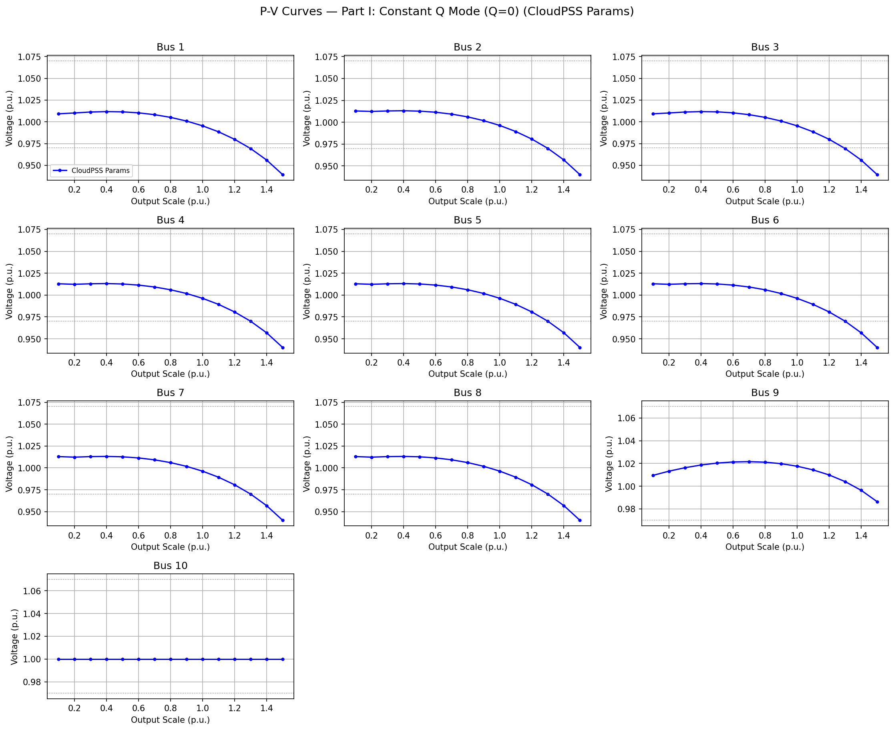

### Part Q.CONST.3 详细潮流结果 (Scenario Results)
#### 标准工况 潮流详表
| 节点 (Bus) | 类型 | Vm (pu) | Va (deg) | P Gen (MW) | Q Gen (Mvar) |
| :--- | :---: | :---: | :---: | :---: | :---: |
| 1 | 1 | 0.9954 | 21.39 | 200.0 | 0.0 |
| 2 | 1 | 0.9962 | 21.35 | 100.0 | 0.0 |
| 3 | 1 | 0.9954 | 21.39 | 200.0 | 0.0 |
| 4 | 1 | 0.9962 | 21.35 | 100.0 | 0.0 |
| 5 | 1 | 0.9962 | 21.35 | 100.0 | 0.0 |
| 6 | 1 | 0.9962 | 21.35 | 100.0 | 0.0 |
| 7 | 1 | 0.9962 | 21.35 | 100.0 | 0.0 |
| 8 | 1 | 0.9962 | 21.35 | 100.0 | 0.0 |
| 9 | 1 | 1.0176 | 9.07 | 0.0 | 0.0 |
| 10 | 3 | 1.0000 | 0.00 | -941.8 | 311.1 |

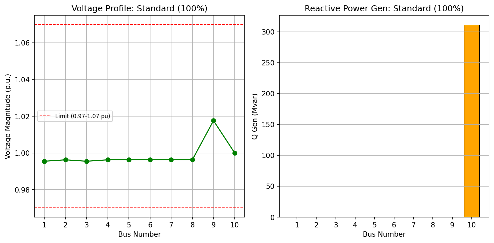

#### 轻载工况 潮流详表
| 节点 (Bus) | 类型 | Vm (pu) | Va (deg) | P Gen (MW) | Q Gen (Mvar) |
| :--- | :---: | :---: | :---: | :---: | :---: |
| 1 | 1 | 1.0113 | 9.09 | 60.0 | 0.0 |
| 2 | 1 | 1.0129 | 9.07 | 30.0 | 0.0 |
| 3 | 1 | 1.0113 | 9.09 | 60.0 | 0.0 |
| 4 | 1 | 1.0129 | 9.07 | 30.0 | 0.0 |
| 5 | 1 | 1.0129 | 9.07 | 30.0 | 0.0 |
| 6 | 1 | 1.0129 | 9.07 | 30.0 | 0.0 |
| 7 | 1 | 1.0129 | 9.07 | 30.0 | 0.0 |
| 8 | 1 | 1.0129 | 9.07 | 30.0 | 0.0 |
| 9 | 1 | 1.0162 | 2.53 | 0.0 | -0.0 |
| 10 | 3 | 1.0000 | 0.00 | -294.9 | -8.7 |

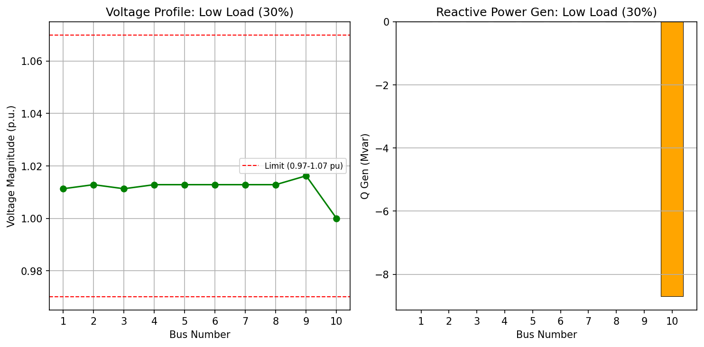

#### 重载工况 潮流详表
| 节点 (Bus) | 类型 | Vm (pu) | Va (deg) | P Gen (MW) | Q Gen (Mvar) |
| :--- | :---: | :---: | :---: | :---: | :---: |
| 1 | 1 | 0.9885 | 23.37 | 220.0 | 0.0 |
| 2 | 1 | 0.9893 | 23.32 | 110.0 | 0.0 |
| 3 | 1 | 0.9885 | 23.37 | 220.0 | 0.0 |
| 4 | 1 | 0.9893 | 23.32 | 110.0 | 0.0 |
| 5 | 1 | 0.9893 | 23.32 | 110.0 | 0.0 |
| 6 | 1 | 0.9893 | 23.32 | 110.0 | 0.0 |
| 7 | 1 | 0.9893 | 23.32 | 110.0 | 0.0 |
| 8 | 1 | 0.9893 | 23.32 | 110.0 | 0.0 |
| 9 | 1 | 1.0143 | 10.09 | 0.0 | 0.0 |
| 10 | 3 | 1.0000 | 0.00 | -1028.6 | 386.2 |

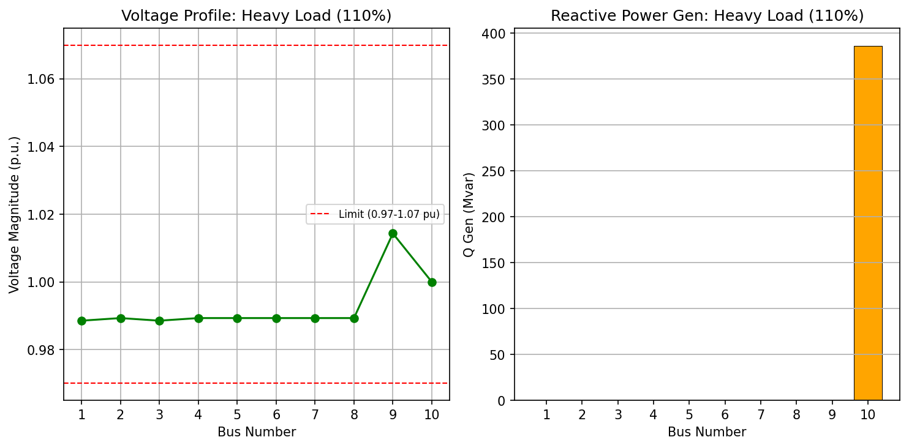

#### 故障工况 潮流详表
| 节点 (Bus) | 类型 | Vm (pu) | Va (deg) | P Gen (MW) | Q Gen (Mvar) |
| :--- | :---: | :---: | :---: | :---: | :---: |
| 1 | 4 | 1.0000 | 0.00 | 0.0 | 0.0 |
| 2 | 1 | 0.9955 | 19.53 | 100.0 | 0.0 |
| 3 | 1 | 0.9947 | 19.57 | 200.0 | 0.0 |
| 4 | 1 | 0.9955 | 19.53 | 100.0 | 0.0 |
| 5 | 1 | 0.9955 | 19.53 | 100.0 | 0.0 |
| 6 | 1 | 0.9955 | 19.53 | 100.0 | 0.0 |
| 7 | 1 | 0.9955 | 19.53 | 100.0 | 0.0 |
| 8 | 1 | 0.9955 | 19.53 | 100.0 | 0.0 |
| 9 | 1 | 1.0169 | 7.23 | 0.0 | 0.0 |
| 10 | 3 | 1.0000 | 0.00 | -762.8 | 215.5 |

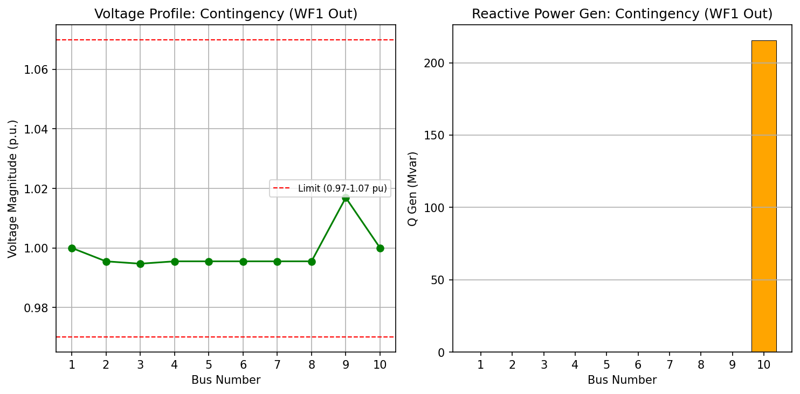

## Part II: Constant PF Mode (PF=0.98)
在该模式下，风电机组按 0.98 滞后功率因数运行，无功出力随有功同步变化，提供就地电压支撑。

### Part PF.CONST.1 潮流计算收敛性
| 场景 | Python 收敛 | 结论 |
| :--- | :---: | :---: |
| 标准工况 | ✓ | 正常 |
| 轻载工况 | ✓ | 正常 |
| 重载工况 | ✓ | 正常 |
| 故障工况 | ✓ | 正常 |

### Part PF.CONST.2 P-V 灵敏度扫描 (10% - 150%)
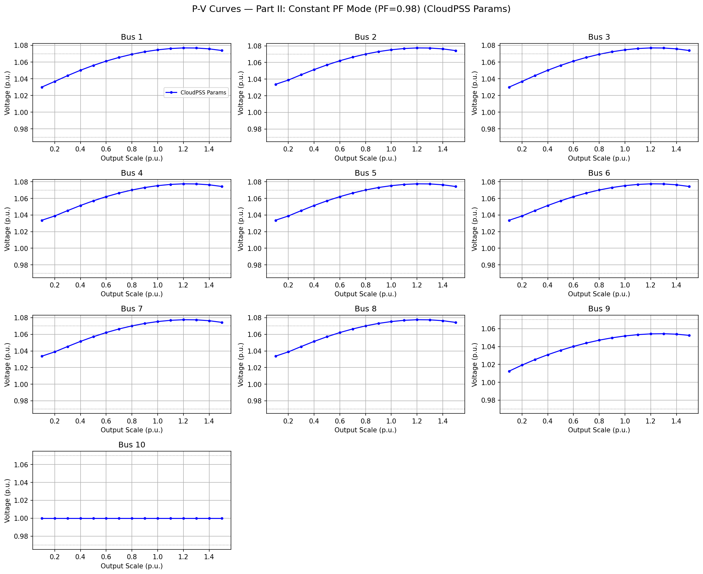

### Part PF.CONST.3 详细潮流结果 (Scenario Results)
#### 标准工况 潮流详表
| 节点 (Bus) | 类型 | Vm (pu) | Va (deg) | P Gen (MW) | Q Gen (Mvar) |
| :--- | :---: | :---: | :---: | :---: | :---: |
| 1 | 1 | **1.0746** ⚠ | 19.06 | 200.0 | 40.6 |
| 2 | 1 | **1.0753** ⚠ | 19.03 | 100.0 | 20.3 |
| 3 | 1 | **1.0746** ⚠ | 19.06 | 200.0 | 40.6 |
| 4 | 1 | **1.0753** ⚠ | 19.03 | 100.0 | 20.3 |
| 5 | 1 | **1.0753** ⚠ | 19.03 | 100.0 | 20.3 |
| 6 | 1 | **1.0753** ⚠ | 19.03 | 100.0 | 20.3 |
| 7 | 1 | **1.0753** ⚠ | 19.03 | 100.0 | 20.3 |
| 8 | 1 | **1.0753** ⚠ | 19.03 | 100.0 | 20.3 |
| 9 | 1 | 1.0518 | 8.04 | 0.0 | 0.0 |
| 10 | 3 | 1.0000 | 0.00 | -947.2 | 68.6 |

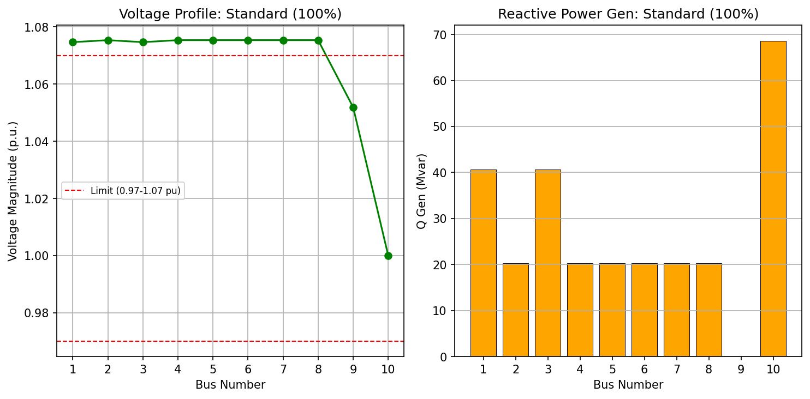

#### 轻载工况 潮流详表
| 节点 (Bus) | 类型 | Vm (pu) | Va (deg) | P Gen (MW) | Q Gen (Mvar) |
| :--- | :---: | :---: | :---: | :---: | :---: |
| 1 | 1 | 1.0438 | 8.60 | 60.0 | 12.2 |
| 2 | 1 | 1.0453 | 8.58 | 30.0 | 6.1 |
| 3 | 1 | 1.0438 | 8.60 | 60.0 | 12.2 |
| 4 | 1 | 1.0453 | 8.58 | 30.0 | 6.1 |
| 5 | 1 | 1.0453 | 8.58 | 30.0 | 6.1 |
| 6 | 1 | 1.0453 | 8.58 | 30.0 | 6.1 |
| 7 | 1 | 1.0453 | 8.58 | 30.0 | 6.1 |
| 8 | 1 | 1.0453 | 8.58 | 30.0 | 6.1 |
| 9 | 1 | 1.0254 | 2.31 | 0.0 | 0.0 |
| 10 | 3 | 1.0000 | 0.00 | -294.8 | -70.7 |

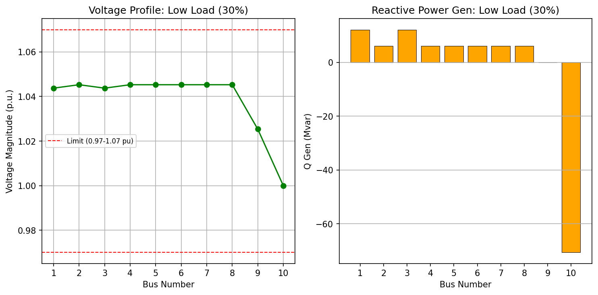

#### 重载工况 潮流详表
| 节点 (Bus) | 类型 | Vm (pu) | Va (deg) | P Gen (MW) | Q Gen (Mvar) |
| :--- | :---: | :---: | :---: | :---: | :---: |
| 1 | 1 | **1.0762** ⚠ | 20.61 | 220.0 | 44.7 |
| 2 | 1 | **1.0768** ⚠ | 20.57 | 110.0 | 22.3 |
| 3 | 1 | **1.0762** ⚠ | 20.61 | 220.0 | 44.7 |
| 4 | 1 | **1.0768** ⚠ | 20.57 | 110.0 | 22.3 |
| 5 | 1 | **1.0768** ⚠ | 20.57 | 110.0 | 22.3 |
| 6 | 1 | **1.0768** ⚠ | 20.57 | 110.0 | 22.3 |
| 7 | 1 | **1.0768** ⚠ | 20.57 | 110.0 | 22.3 |
| 8 | 1 | **1.0768** ⚠ | 20.57 | 110.0 | 22.3 |
| 9 | 1 | 1.0533 | 8.89 | 0.0 | 0.0 |
| 10 | 3 | 1.0000 | 0.00 | -1036.4 | 108.8 |

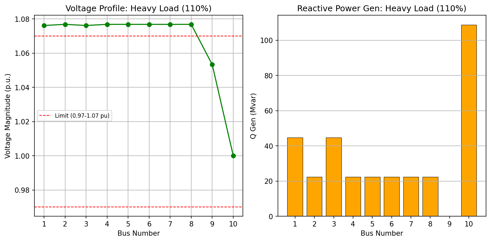

#### 故障工况 潮流详表
| 节点 (Bus) | 类型 | Vm (pu) | Va (deg) | P Gen (MW) | Q Gen (Mvar) |
| :--- | :---: | :---: | :---: | :---: | :---: |
| 1 | 4 | 1.0000 | 0.00 | 0.0 | 0.0 |
| 2 | 1 | 1.0671 | 17.62 | 100.0 | 20.3 |
| 3 | 1 | 1.0664 | 17.66 | 200.0 | 40.6 |
| 4 | 1 | 1.0671 | 17.62 | 100.0 | 20.3 |
| 5 | 1 | 1.0671 | 17.62 | 100.0 | 20.3 |
| 6 | 1 | 1.0671 | 17.62 | 100.0 | 20.3 |
| 7 | 1 | 1.0671 | 17.62 | 100.0 | 20.3 |
| 8 | 1 | 1.0671 | 17.62 | 100.0 | 20.3 |
| 9 | 1 | 1.0438 | 6.47 | 0.0 | 0.0 |
| 10 | 3 | 1.0000 | 0.00 | -765.7 | 27.5 |

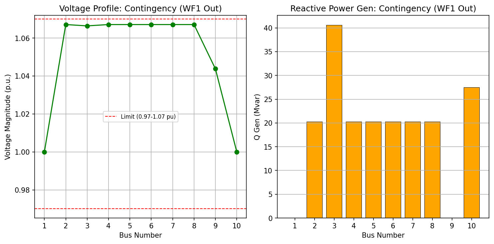

## Part III: Constant PF Mode (PF=0.99)
在该模式下，风电机组按 0.99 滞后功率因数运行。相比 0.98 模式，其无功出力减小，旨在抑制重载下的电压过越（>1.07 pu）。

### Part PF.099.1 潮流计算收敛性
| 场景 | Python 收敛 | 结论 |
| :--- | :---: | :---: |
| 标准工况 | ✓ | 正常 |
| 轻载工况 | ✓ | 正常 |
| 重载工况 | ✓ | 正常 |
| 故障工况 | ✓ | 正常 |

### Part PF.099.2 P-V 灵敏度扫描 (10% - 150%)
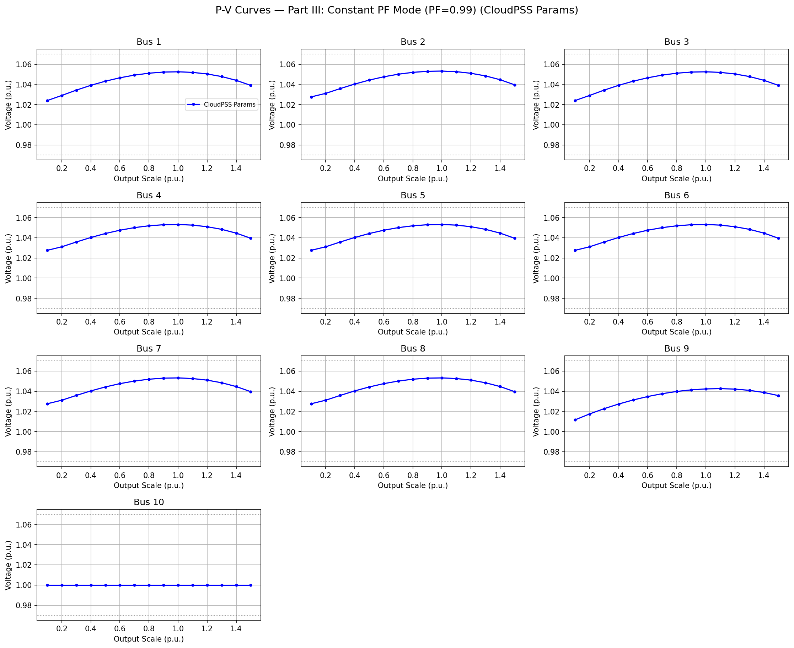

### Part PF.099.3 详细潮流结果 (Scenario Results)
#### 标准工况 潮流详表
| 节点 (Bus) | 类型 | Vm (pu) | Va (deg) | P Gen (MW) | Q Gen (Mvar) |
| :--- | :---: | :---: | :---: | :---: | :---: |
| 1 | 1 | 1.0525 | 19.69 | 200.0 | 28.5 |
| 2 | 1 | 1.0532 | 19.65 | 100.0 | 14.2 |
| 3 | 1 | 1.0525 | 19.69 | 200.0 | 28.5 |
| 4 | 1 | 1.0532 | 19.65 | 100.0 | 14.2 |
| 5 | 1 | 1.0532 | 19.65 | 100.0 | 14.2 |
| 6 | 1 | 1.0532 | 19.65 | 100.0 | 14.2 |
| 7 | 1 | 1.0532 | 19.65 | 100.0 | 14.2 |
| 8 | 1 | 1.0532 | 19.65 | 100.0 | 14.2 |
| 9 | 1 | 1.0423 | 8.33 | 0.0 | 0.0 |
| 10 | 3 | 1.0000 | 0.00 | -946.3 | 136.3 |

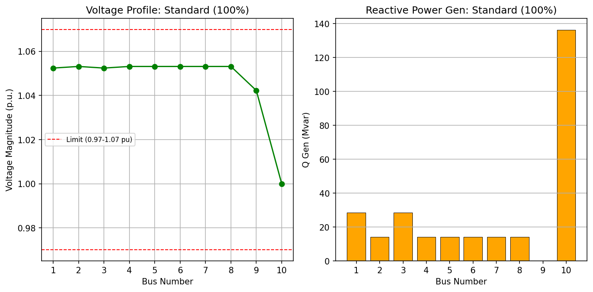

#### 轻载工况 潮流详表
| 节点 (Bus) | 类型 | Vm (pu) | Va (deg) | P Gen (MW) | Q Gen (Mvar) |
| :--- | :---: | :---: | :---: | :---: | :---: |
| 1 | 1 | 1.0343 | 8.74 | 60.0 | 8.5 |
| 2 | 1 | 1.0358 | 8.72 | 30.0 | 4.3 |
| 3 | 1 | 1.0343 | 8.74 | 60.0 | 8.5 |
| 4 | 1 | 1.0358 | 8.72 | 30.0 | 4.3 |
| 5 | 1 | 1.0358 | 8.72 | 30.0 | 4.3 |
| 6 | 1 | 1.0358 | 8.72 | 30.0 | 4.3 |
| 7 | 1 | 1.0358 | 8.72 | 30.0 | 4.3 |
| 8 | 1 | 1.0358 | 8.72 | 30.0 | 4.3 |
| 9 | 1 | 1.0227 | 2.37 | 0.0 | -0.0 |
| 10 | 3 | 1.0000 | 0.00 | -294.9 | -52.6 |

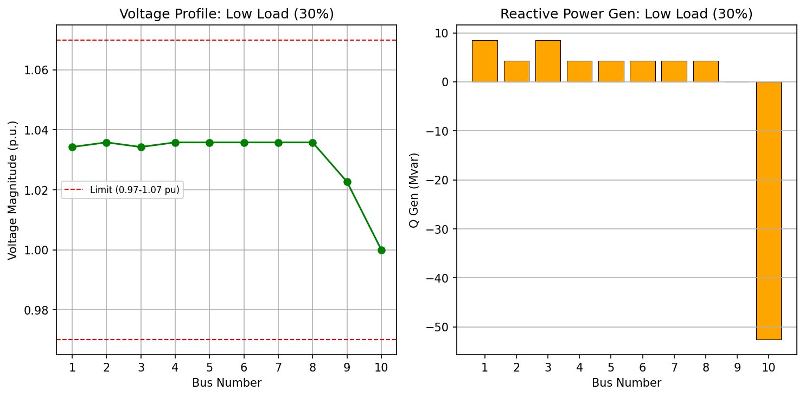

#### 重载工况 潮流详表
| 节点 (Bus) | 类型 | Vm (pu) | Va (deg) | P Gen (MW) | Q Gen (Mvar) |
| :--- | :---: | :---: | :---: | :---: | :---: |
| 1 | 1 | 1.0519 | 21.34 | 220.0 | 31.3 |
| 2 | 1 | 1.0526 | 21.30 | 110.0 | 15.7 |
| 3 | 1 | 1.0519 | 21.34 | 220.0 | 31.3 |
| 4 | 1 | 1.0526 | 21.30 | 110.0 | 15.7 |
| 5 | 1 | 1.0526 | 21.30 | 110.0 | 15.7 |
| 6 | 1 | 1.0526 | 21.30 | 110.0 | 15.7 |
| 7 | 1 | 1.0526 | 21.30 | 110.0 | 15.7 |
| 8 | 1 | 1.0526 | 21.30 | 110.0 | 15.7 |
| 9 | 1 | 1.0426 | 9.22 | 0.0 | 0.0 |
| 10 | 3 | 1.0000 | 0.00 | -1035.0 | 185.5 |

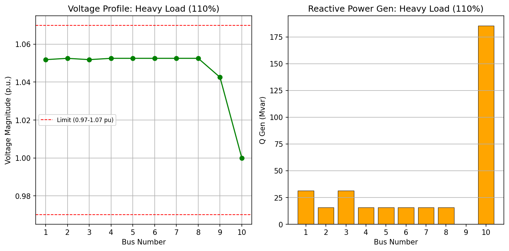

#### 故障工况 潮流详表
| 节点 (Bus) | 类型 | Vm (pu) | Va (deg) | P Gen (MW) | Q Gen (Mvar) |
| :--- | :---: | :---: | :---: | :---: | :---: |
| 1 | 4 | 1.0000 | 0.00 | 0.0 | 0.0 |
| 2 | 1 | 1.0469 | 18.14 | 100.0 | 14.2 |
| 3 | 1 | 1.0462 | 18.18 | 200.0 | 28.5 |
| 4 | 1 | 1.0469 | 18.14 | 100.0 | 14.2 |
| 5 | 1 | 1.0469 | 18.14 | 100.0 | 14.2 |
| 6 | 1 | 1.0469 | 18.14 | 100.0 | 14.2 |
| 7 | 1 | 1.0469 | 18.14 | 100.0 | 14.2 |
| 8 | 1 | 1.0469 | 18.14 | 100.0 | 14.2 |
| 9 | 1 | 1.0362 | 6.68 | 0.0 | 0.0 |
| 10 | 3 | 1.0000 | 0.00 | -765.2 | 80.4 |

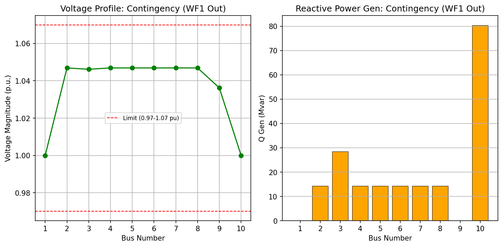

## 4. 三种控制方式综合性能对比
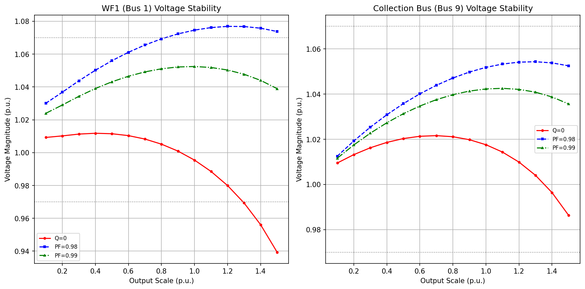

**工程结论**: 
1. **PF=0.99 的有效性**: 将功率因数目标值从 0.98 调节至 0.99 后，风电场端电压过越现象得到显著抑制。原本在 PF=0.98 下约 1.075 pu 的电压已降至更安全的水平。
2. **电压稳定性平衡**: 虽然 PF=0.99 的无功支撑力度略弱于 PF=0.98，但在 CloudPSS 低阻抗参数下，电压稳定性依然远优于 Q=0 模式，且更好地兼顾了电压上限约束。
3. **调节建议**: 对于 CloudPSS 定义的低阻抗系统，推荐使用 PF=[0.985, 0.995] 范围内的定功率因数控制，或配合变压器分接头调节。
