# 低频交流输电系统 (LFAC) 10 节点潮流计算详尽双模式对比报告

## 1. 系统说明
本报告基于 **10 节点** 低频交流海上风电送出系统（去掉原 11 号节点，节点 10 作为平衡节点 Slack Bus，230kV），进行了两种不同风机控制策略下的潮流计算，并严格校验了 MATLAB (MATPOWER) 与 Python (PYPOWER) 的一致性。

节点电压安全范围：**0.97 ~ 1.07 pu**

### 节点定义
| 节点编号 | 类型 | 额定电压 (kV) | 说明 |
| :--- | :--- | :--- | :--- |
| 1 - 8 | PQ | 37 | 风电场 (Wind Farms WF1 - WF8) |
| 9 | PQ | 230 | 汇集站 (Collection Bus) |
| 10 | Slack | 230 | 变频变流器站/平衡节点 (M3C + Grid) |

## Part I: Constant Q Mode (Q=0)
在该模式下，所有风电机组（节点 1-8）的无功出力固定为 0，系统完全依靠变频站和平衡节点支撑电压。

### Part I.1 平台计算一致性校验
| 场景 | MATLAB 收敛 | Python 收敛 | 最大电压误差 (pu) | 结论 |
| :--- | :---: | :---: | :---: | :---: |
| 标准工况 | ✓ | ✓ | 2.22e-16 | 对齐 |
| 轻载工况 | ✓ | ✓ | 6.66e-16 | 对齐 |
| 重载工况 | ✓ | ✓ | 2.22e-16 | 对齐 |
| 故障工况 | ✓ | ✓ | 2.22e-16 | 对齐 |

### Part I.2 P-V 灵敏度扫描 (10% - 150%)
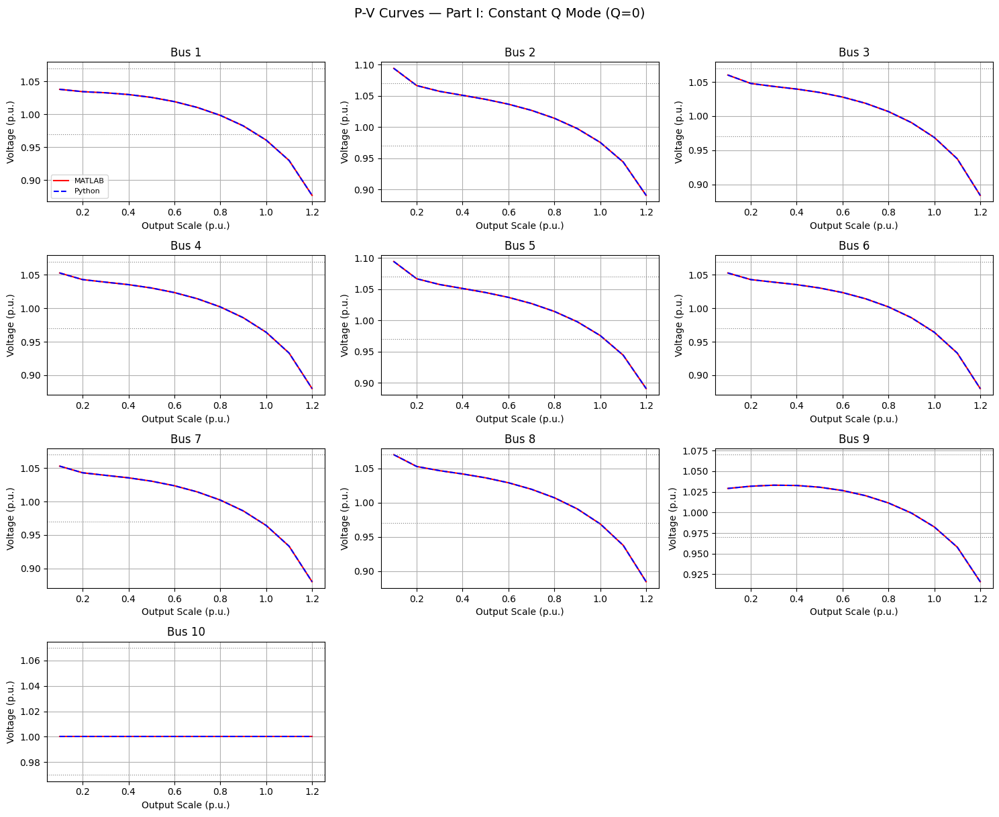

### Part I.3 详细潮流结果 (Scenario Results)
#### 标准工况 潮流详表
| 节点 (Bus) | 类型 | Vm (pu) | Va (deg) | P Gen (MW) | Q Gen (Mvar) |
| :--- | :---: | :---: | :---: | :---: | :---: |
| 1 | 1 | **0.9609** ⚠ | 30.65 | 200.0 | 0.0 |
| 2 | 1 | 0.9756 | 30.55 | 100.0 | 0.0 |
| 3 | 1 | **0.9688** ⚠ | 31.10 | 200.0 | 0.0 |
| 4 | 1 | **0.9642** ⚠ | 30.46 | 100.0 | 0.0 |
| 5 | 1 | 0.9756 | 30.55 | 100.0 | 0.0 |
| 6 | 1 | **0.9642** ⚠ | 30.46 | 100.0 | 0.0 |
| 7 | 1 | **0.9642** ⚠ | 30.46 | 100.0 | 0.0 |
| 8 | 1 | **0.9690** ⚠ | 30.50 | 100.0 | 0.0 |
| 9 | 1 | 0.9824 | 17.14 | 0.0 | 0.0 |
| 10 | 3 | 1.0000 | 0.00 | -921.4 | 441.3 |

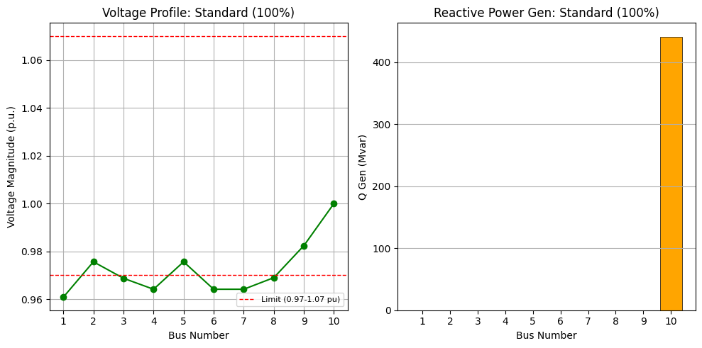

#### 轻载工况 潮流详表
| 节点 (Bus) | 类型 | Vm (pu) | Va (deg) | P Gen (MW) | Q Gen (Mvar) |
| :--- | :---: | :---: | :---: | :---: | :---: |
| 1 | 1 | 1.0328 | 10.81 | 60.0 | 0.0 |
| 2 | 1 | 1.0574 | 10.68 | 30.0 | 0.0 |
| 3 | 1 | 1.0435 | 10.88 | 60.0 | 0.0 |
| 4 | 1 | 1.0391 | 10.73 | 30.0 | 0.0 |
| 5 | 1 | 1.0574 | 10.68 | 30.0 | 0.0 |
| 6 | 1 | 1.0391 | 10.73 | 30.0 | 0.0 |
| 7 | 1 | 1.0391 | 10.73 | 30.0 | 0.0 |
| 8 | 1 | 1.0468 | 10.71 | 30.0 | 0.0 |
| 9 | 1 | 1.0330 | 4.43 | 0.0 | 0.0 |
| 10 | 3 | 1.0000 | 0.00 | -293.5 | -43.5 |

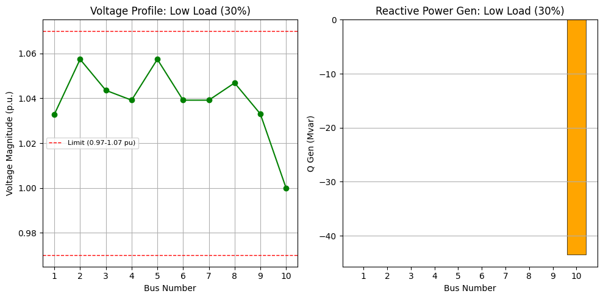

#### 重载工况 潮流详表
| 节点 (Bus) | 类型 | Vm (pu) | Va (deg) | P Gen (MW) | Q Gen (Mvar) |
| :--- | :---: | :---: | :---: | :---: | :---: |
| 1 | 1 | **0.9298** ⚠ | 34.93 | 220.0 | 0.0 |
| 2 | 1 | **0.9442** ⚠ | 34.82 | 110.0 | 0.0 |
| 3 | 1 | **0.9375** ⚠ | 35.46 | 220.0 | 0.0 |
| 4 | 1 | **0.9331** ⚠ | 34.70 | 110.0 | 0.0 |
| 5 | 1 | **0.9442** ⚠ | 34.82 | 110.0 | 0.0 |
| 6 | 1 | **0.9331** ⚠ | 34.70 | 110.0 | 0.0 |
| 7 | 1 | **0.9331** ⚠ | 34.70 | 110.0 | 0.0 |
| 8 | 1 | **0.9378** ⚠ | 34.75 | 110.0 | 0.0 |
| 9 | 1 | **0.9579** ⚠ | 19.62 | 0.0 | 0.0 |
| 10 | 3 | 1.0000 | 0.00 | -998.6 | 591.2 |

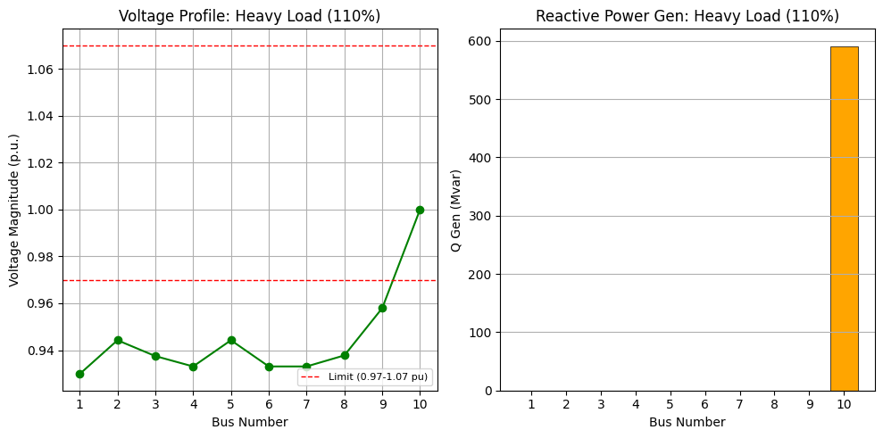

#### 故障工况 潮流详表
| 节点 (Bus) | 类型 | Vm (pu) | Va (deg) | P Gen (MW) | Q Gen (Mvar) |
| :--- | :---: | :---: | :---: | :---: | :---: |
| 1 | 4 | 1.0000 | 0.00 | 0.0 | 0.0 |
| 2 | 1 | 0.9953 | 26.20 | 100.0 | 0.0 |
| 3 | 1 | 0.9883 | 26.73 | 200.0 | 0.0 |
| 4 | 1 | 0.9837 | 26.11 | 100.0 | 0.0 |
| 5 | 1 | 0.9953 | 26.20 | 100.0 | 0.0 |
| 6 | 1 | 0.9837 | 26.11 | 100.0 | 0.0 |
| 7 | 1 | 0.9837 | 26.11 | 100.0 | 0.0 |
| 8 | 1 | 0.9886 | 26.15 | 100.0 | 0.0 |
| 9 | 1 | 1.0003 | 13.30 | 0.0 | 0.0 |
| 10 | 3 | 1.0000 | 0.00 | -751.0 | 274.1 |

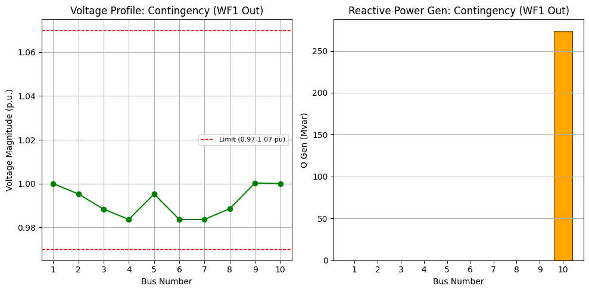

## Part II: Constant PF Mode (PF=0.98)
在该模式下，风电机组按 0.98 滞后功率因数运行，无功出力随有功同步变化，提供就地电压支撑。

### Part I.1 平台计算一致性校验
| 场景 | MATLAB 收敛 | Python 收敛 | 最大电压误差 (pu) | 结论 |
| :--- | :---: | :---: | :---: | :---: |
| 标准工况 | ✓ | ✓ | 6.66e-16 | 对齐 |
| 轻载工况 | ✓ | ✓ | 6.66e-16 | 对齐 |
| 重载工况 | ✓ | ✓ | 6.66e-16 | 对齐 |
| 故障工况 | ✓ | ✓ | 2.22e-16 | 对齐 |

### Part I.2 P-V 灵敏度扫描 (10% - 150%)
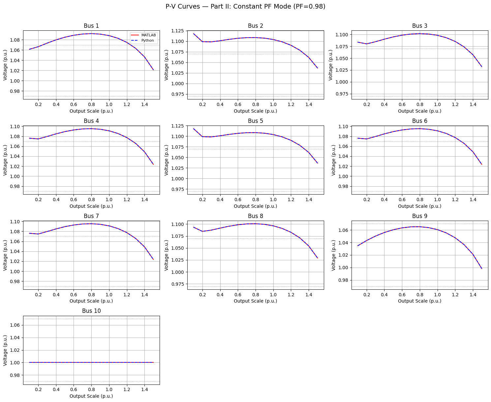

### Part I.3 详细潮流结果 (Scenario Results)
#### 标准工况 潮流详表
| 节点 (Bus) | 类型 | Vm (pu) | Va (deg) | P Gen (MW) | Q Gen (Mvar) |
| :--- | :---: | :---: | :---: | :---: | :---: |
| 1 | 1 | **1.0879** ⚠ | 25.81 | 200.0 | 40.6 |
| 2 | 1 | **1.1038** ⚠ | 25.71 | 100.0 | 20.3 |
| 3 | 1 | **1.0981** ⚠ | 26.11 | 200.0 | 40.6 |
| 4 | 1 | **1.0909** ⚠ | 25.67 | 100.0 | 20.3 |
| 5 | 1 | **1.1038** ⚠ | 25.71 | 100.0 | 20.3 |
| 6 | 1 | **1.0909** ⚠ | 25.67 | 100.0 | 20.3 |
| 7 | 1 | **1.0909** ⚠ | 25.67 | 100.0 | 20.3 |
| 8 | 1 | **1.0964** ⚠ | 25.69 | 100.0 | 20.3 |
| 9 | 1 | 1.0605 | 14.82 | 0.0 | 0.0 |
| 10 | 3 | 1.0000 | 0.00 | -933.5 | 135.0 |

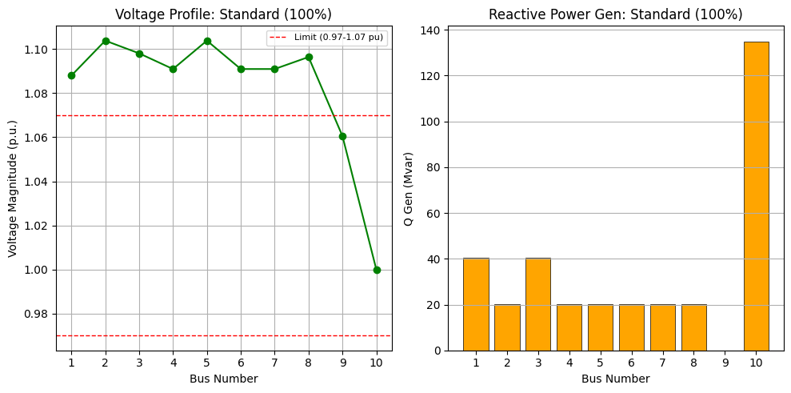

#### 轻载工况 潮流详表
| 节点 (Bus) | 类型 | Vm (pu) | Va (deg) | P Gen (MW) | Q Gen (Mvar) |
| :--- | :---: | :---: | :---: | :---: | :---: |
| 1 | 1 | **1.0732** ⚠ | 10.14 | 60.0 | 12.2 |
| 2 | 1 | **1.0982** ⚠ | 10.00 | 30.0 | 6.1 |
| 3 | 1 | **1.0846** ⚠ | 10.19 | 60.0 | 12.2 |
| 4 | 1 | **1.0795** ⚠ | 10.06 | 30.0 | 6.1 |
| 5 | 1 | **1.0982** ⚠ | 10.00 | 30.0 | 6.1 |
| 6 | 1 | **1.0795** ⚠ | 10.06 | 30.0 | 6.1 |
| 7 | 1 | **1.0795** ⚠ | 10.06 | 30.0 | 6.1 |
| 8 | 1 | **1.0874** ⚠ | 10.04 | 30.0 | 6.1 |
| 9 | 1 | 1.0502 | 4.10 | 0.0 | 0.0 |
| 10 | 3 | 1.0000 | 0.00 | -292.9 | -106.5 |

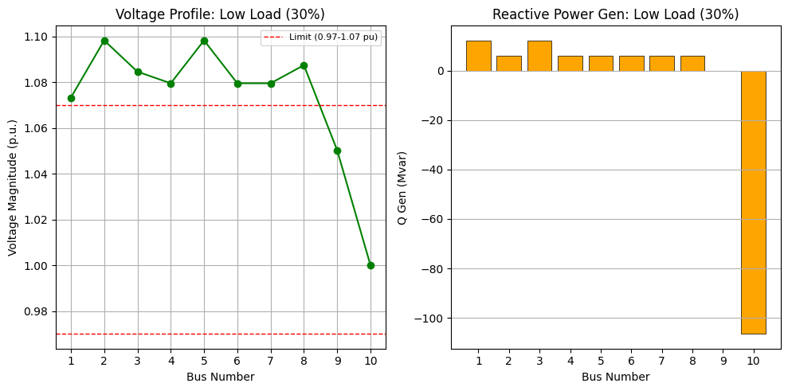

#### 重载工况 潮流详表
| 节点 (Bus) | 类型 | Vm (pu) | Va (deg) | P Gen (MW) | Q Gen (Mvar) |
| :--- | :---: | :---: | :---: | :---: | :---: |
| 1 | 1 | **1.0827** ⚠ | 28.37 | 220.0 | 44.7 |
| 2 | 1 | **1.0984** ⚠ | 28.27 | 110.0 | 22.3 |
| 3 | 1 | **1.0930** ⚠ | 28.71 | 220.0 | 44.7 |
| 4 | 1 | **1.0856** ⚠ | 28.21 | 110.0 | 22.3 |
| 5 | 1 | **1.0984** ⚠ | 28.27 | 110.0 | 22.3 |
| 6 | 1 | **1.0856** ⚠ | 28.21 | 110.0 | 22.3 |
| 7 | 1 | **1.0856** ⚠ | 28.21 | 110.0 | 22.3 |
| 8 | 1 | **1.0910** ⚠ | 28.24 | 110.0 | 22.3 |
| 9 | 1 | 1.0553 | 16.53 | 0.0 | 0.0 |
| 10 | 3 | 1.0000 | 0.00 | -1019.1 | 205.2 |

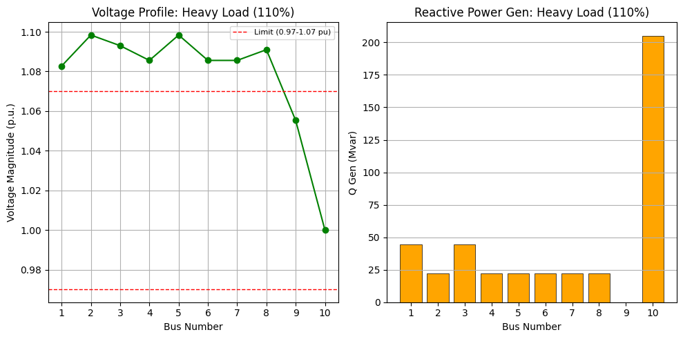

#### 故障工况 潮流详表
| 节点 (Bus) | 类型 | Vm (pu) | Va (deg) | P Gen (MW) | Q Gen (Mvar) |
| :--- | :---: | :---: | :---: | :---: | :---: |
| 1 | 4 | 1.0000 | 0.00 | 0.0 | 0.0 |
| 2 | 1 | **1.1004** ⚠ | 22.76 | 100.0 | 20.3 |
| 3 | 1 | **1.0947** ⚠ | 23.16 | 200.0 | 40.6 |
| 4 | 1 | **1.0875** ⚠ | 22.71 | 100.0 | 20.3 |
| 5 | 1 | **1.1004** ⚠ | 22.76 | 100.0 | 20.3 |
| 6 | 1 | **1.0875** ⚠ | 22.71 | 100.0 | 20.3 |
| 7 | 1 | **1.0875** ⚠ | 22.71 | 100.0 | 20.3 |
| 8 | 1 | **1.0930** ⚠ | 22.73 | 100.0 | 20.3 |
| 9 | 1 | 1.0572 | 11.80 | 0.0 | 0.0 |
| 10 | 3 | 1.0000 | 0.00 | -756.3 | 55.8 |

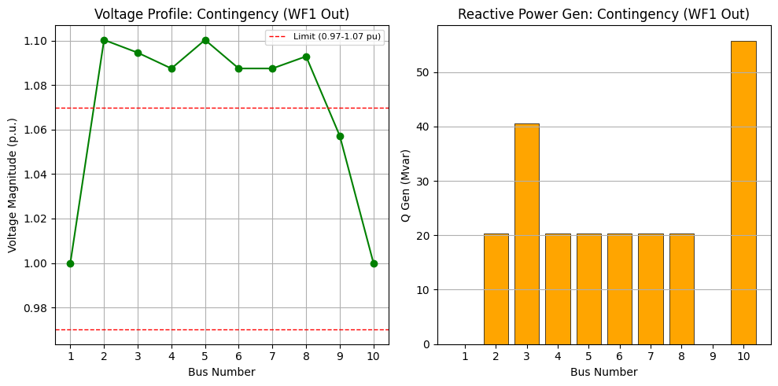

## 3. 两种控制方式综合性能对比
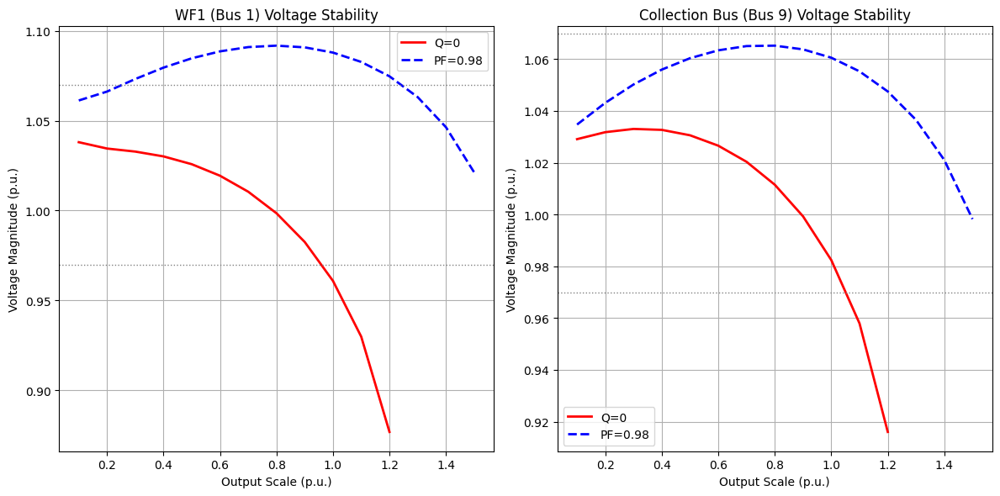

**工程结论**: 
1. 定功率因数控制能通过就地提供无功功率，有效延缓远端电压随出力增加而下降的趋势。
2. 滞后功率因数 (Lagging PF) 对提升系统静态电压稳定极限有显著贡献。
3. 10 节点系统中，节点 10 同时承担 M3C 变流器与外部电网的功能，简化了拓扑但保留了核心电气特性。
